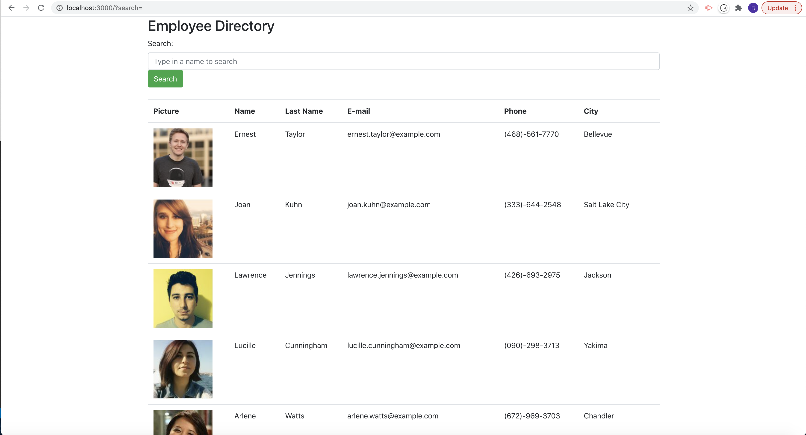

# employee-directory

## Table of Content: 
#### (Link to Github Repo) [https://github.com/mazzeiroman/employee-directory]
- [Description](#description)
- [Installation](#installation)
- [Usage](#usage)
- [Contributing](#Contributing)
- [Tests](#tests)
- [License](#license)
- [Questions](#Questions)
- [Credits](#credits)

## Link to Github Repo
https://github.com/mazzeiroman/employee-directory

## Link to the Deployed Application
https://mazzeiroman.github.io/employee-directory/

 

## Description
 An employee directory with React. This application's UI is broken up into components, manage components state, and respond to user events.
 
## Installation 
 This aplication is deployed to heroku so no installation is needed unless to be modified. You must install node.JS, and the JSON Package and also install MySQL and MySQL Workbench.

## Usage
Employee directory with React, As a user, you are able to view your entire employee directory at once so that you have quick access to their information.

## Contributing
Roman Mazzei.

## Tests
 None

## License
       MIT
  
## Questions
For any questions you can find the constributors on Github:

> GitHub https://github.com/mazzeiroman
      
### Credits
© 2021 Roman Mazzei.      
      